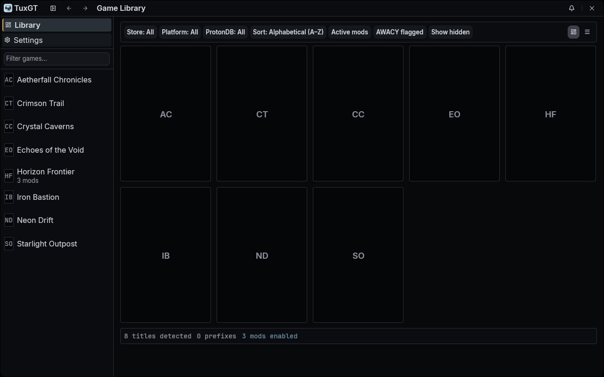
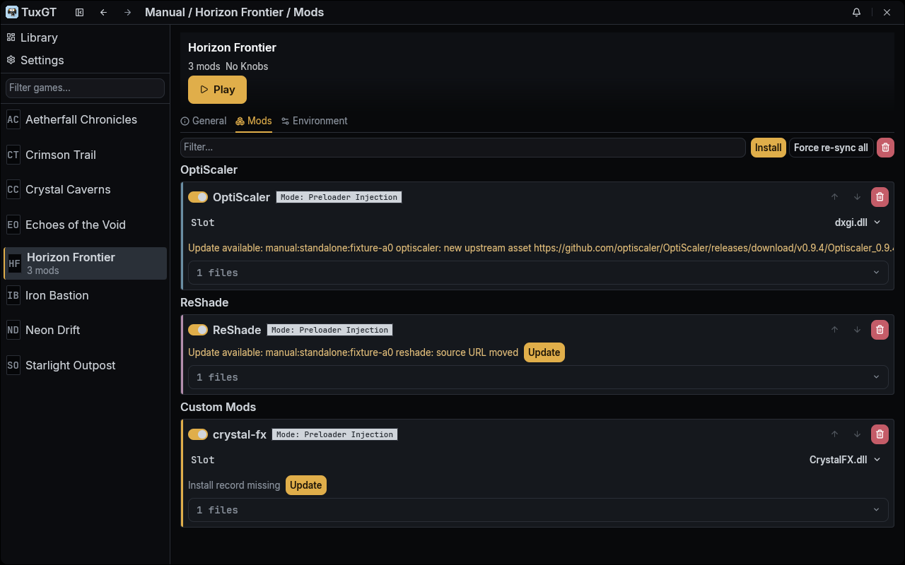
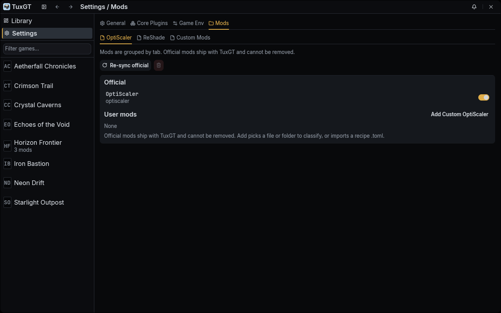

#  TuxGT -- Tux Gamer Tools

TuxGT is a Linux desktop app for managing injector and runtime mods — like OptiScaler and ReShade — across your game libraries. It keeps a card library of your Steam and Heroic games, lets you turn mods on or off per game, and launches games with the right wrappers and settings so you do not have to copy DLLs by hand. It stages files without touching the game folder (preload); mods load through the protonfixes hook or a launch-options wrapper.

## Disclaimer

> [!WARNING]
> **Yes, this is AI slop.** Every line of code and docs here was written with the help of a (mostly) house-trained AI, and was somewhat reviewed and manually tested. If AI-made software isn't your thing, then this one isn't for you.

> [!NOTE]
> **Built and tested on CachyOS.** Should run on most modern linux box, but no promises. Proton-GE will probably work as well. Non-Arch distros are untested, I have no plans to install other distros. Share logs and I will take a look with my AI buddy, if you know the fix even better.

> [!CAUTION]
> **Flatpak / AppImage / Snap: untested and unplanned.** I don't use those and don't plan to, contributions are welcome. The installer already drops a hook file where it finds a Flatpak Heroic tree, so it's not starting from zero.

## Features

- Library for Steam and Heroic (GOG and Epic through Heroic) — with cover art
- Per-game enable and install for OptiScaler, ReShade, ReShade addons, shader packs, texture packs, and custom DLLs
- Preload only: never writes into the game folder; mods load via the protonfixes hook or a launch-options wrapper
- Warns about missing ReShade and DLL slot conflicts — and offers a fix
- Launch from TuxGT with no store change, or persist a wrapper so Steam/Heroic's own Play button loads mods (restart the store once after changing this)
- Once hooked, the app doesn't need to be running — Steam/Heroic Play loads mods on its own
- Proton and Wine aware, including GE and CachyOS Proton where available
- Per-game env options: Proton/Wine/DXVK/VKD3D/Mesa knobs plus custom `KEY=VALUE`, with global defaults

## Quick install

```sh
curl -fsSL https://raw.githubusercontent.com/waddlr/tuxgt/master/install.sh | bash
```

Or install by hand — see [docs/install.md](docs/install.md) for prerequisites, manual steps, updating, and uninstall.

## Supported providers and mods

**Game providers:** Steam and Heroic. Heroic covers GOG, Epic, and sideloaded games. Both are discovered automatically.

**Supported games:** 64-bit DirectX 11/12 titles. 32-bit games and other graphics APIs are not supported yet.

**Mods shipped in the package** (`mods/official/`): OptiScaler, ReShade 6.8.x, d3dcompiler_47 (a helper DLL). OptiScaler and ReShade are downloaded at runtime — the tarball only carries the recipes, not the DLLs. Custom builds of OptiScaler and ReShade are supported through the Custom templates below.

**Templates for your own packs** (`share/templates/` when installed — `mods/templates/` in the repo): Custom OptiScaler, Custom ReShade, ReShade Addon, ReShade Shader, ReShade Texture, Custom Mod, and the RenoDX and Luma HDR families. See [docs/mods.md](docs/mods.md).

## Docs

- [Install](docs/install.md) — end-user setup, update, uninstall
- [Quickstart](docs/quickstart.md) — first launch to Play
- [Mods](docs/mods.md) — what each pack type does and how to add one
- [Custom OptiScaler](docs/custom-optiscaler.md) — running a third-party OptiScaler build
- [Env](docs/env.md) — per-game env options and global defaults
- [Troubleshooting](docs/troubleshooting.md) — common issues
- [Build](docs/build.md) — building from source (developers)

## Screenshots





## License

MIT — see [LICENSE.md](LICENSE.md).
