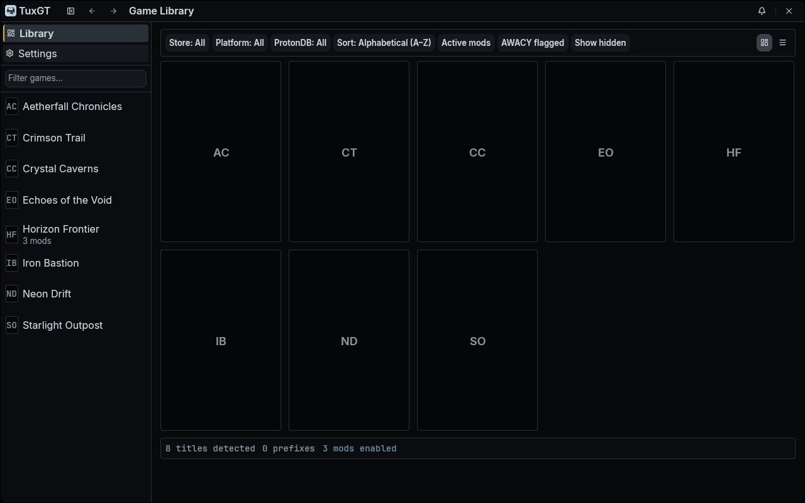
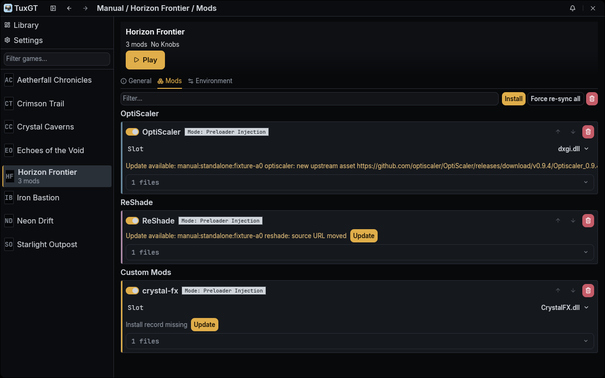
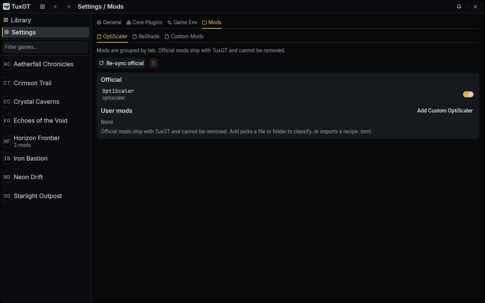

#  TuxGT -- Tux Gamer Tools

TuxGT is a Linux desktop app for managing injector and runtime mods — like OptiScaler and ReShade — across your game libraries. It keeps a library of your Steam and Heroic games, lets you turn mods on or off per game, and launches games with the right wrappers and settings so you do not have to copy files by hand and it also works without touching your game install - most times.

## Disclaimer

> [!WARNING]
> **Yes, this is AI slop.** Every line of code and docs here was written with the help of a (mostly) house-trained AI, and was somewhat reviewed and manually tested. If AI-made software isn't your thing, then this one isn't for you.

> [!NOTE]
> **Built and tested on CachyOS.** Should run on most modern linux box, but no promises. Proton-GE will probably work as well. Non-Arch distros are untested, I have no plans to install other distros. Share logs and I will take a look with my AI buddy, if you know the fix even better.

> [!CAUTION]
> **Flatpak / AppImage / Snap: untested and unplanned.** I don't use those and don't plan to, contributions are welcome. The installer already drops a hook file where it finds a Flatpak Heroic tree, so it's not starting from zero.

## Features

- Library for Steam, Heroic, and manual EXEs, with cover art
- Per-game OptiScaler, ReShade, addons, shaders, textures, and custom DLLs
- Preload by default — game folder stays untouched
- Missing-ReShade and DLL-slot warnings with fixes
- Play from TuxGT or the store button; no background app needed once set up
- Proton/Wine aware, including GE and CachyOS
- Per-game env knobs with global defaults

## Quick install

```sh
curl -fsSL https://raw.githubusercontent.com/waddlr/tuxgt/master/install.sh | bash
```

Or install by hand — see [docs/install.md](docs/install.md) for prerequisites, manual steps, updating, and uninstall.

## Supported providers and mods

**Game providers:** Steam and Heroic. Heroic covers GOG, Epic, and sideloaded games. Both are discovered automatically.

**Supported games:** 64-bit DirectX 11/12 titles. 32-bit, DX9/10, Vulkan and OpenGL are not supported. Games show up on library, and mod installation is allowed, but proper support and testing hasn't been done.

**Mods shipped in the package** (`mods/official/`, 9 recipes): OptiScaler and the OptiScaler y4my4m v4 fork (64-bit games only), ReShade 6.8.x, and d3dcompiler_47 (a helper DLL) are downloaded at runtime; NVIDIA Streamline, nvngx_dlssnr plus its workaround proxy, RenoDX DLSS, and Deep Fried Chicken v3 (64-bit) are files you provide. The tarball only carries the recipes, never the DLLs. Custom builds of OptiScaler and ReShade are supported through the Custom templates below.

**Templates for your own packs** (`share/templates/` when installed — `mods/templates/` in the repo): Custom OptiScaler, Custom ReShade, ReShade Addon, ReShade Shader, ReShade Texture, Custom Mod, and the RenoDX and Luma HDR families. See [docs/mods.md](docs/mods.md).

## Docs

- [Install](docs/install.md) — end-user setup, update, uninstall
- [Quickstart](docs/quickstart.md) — first launch to Play
- [Mods](docs/mods.md) — what each pack type does and how to add one
- [OptiScaler y4my4m fork](docs/mods/optiscaler-y4my4m.md) — running a third-party OptiScaler build
- [Deep Fried Chicken](docs/mods/deep-fried-chicken.md) — DFC v3 ReShade addon setup
- [RenoDX DLSS](docs/mods/renodx-dlss.md) — RenoDX DLSS addon setup
- [Env](docs/env.md) — per-game env options and global defaults
- [Troubleshooting](docs/troubleshooting.md) — common issues
- [Known issues](KNOWN_ISSUES.md) — open bugs
- [Build](docs/build.md) — building from source (developers)

## Screenshots





## License

MIT — see [LICENSE.md](LICENSE.md).
